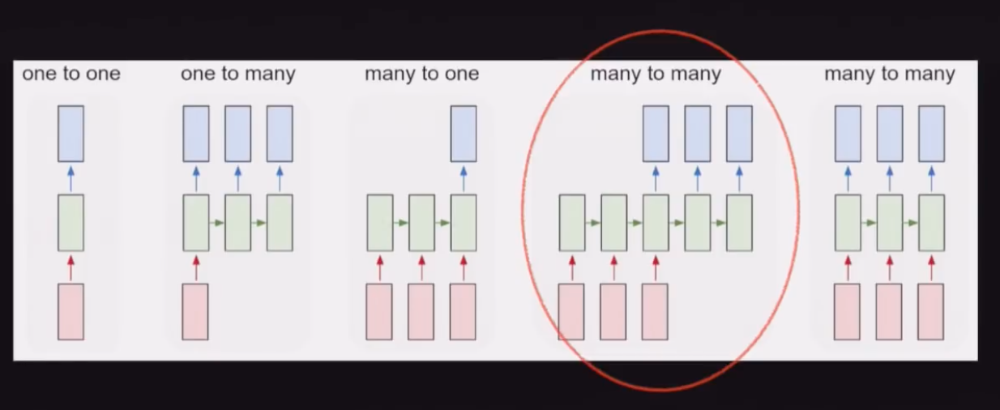
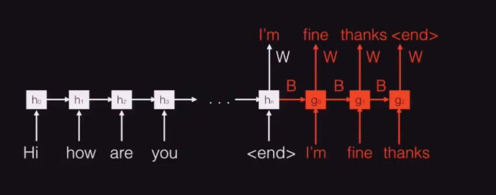
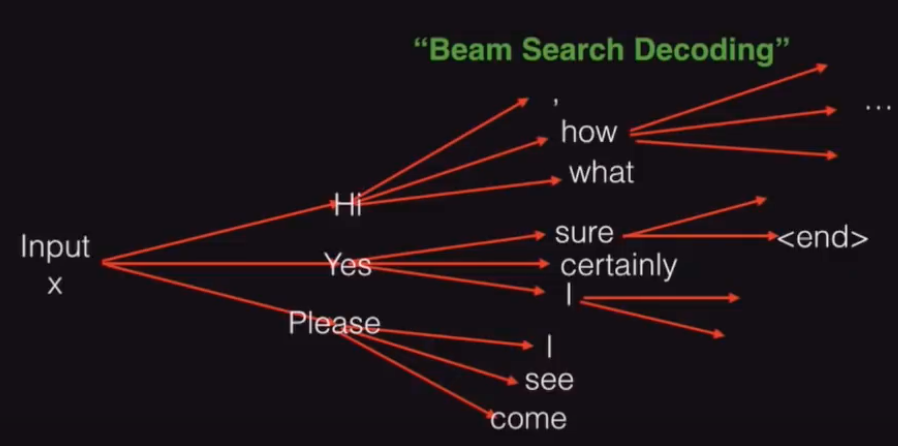
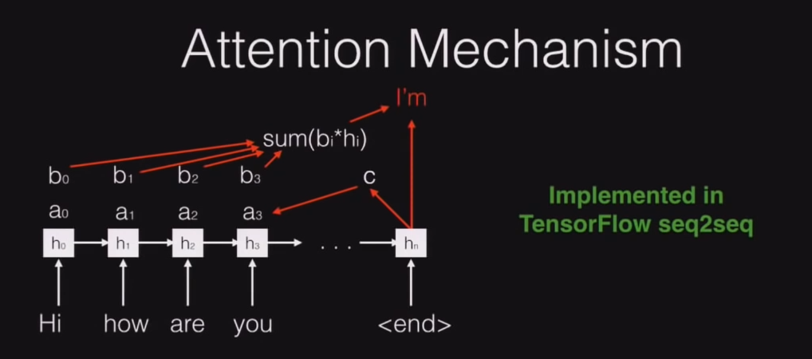

# seq2seq 

Notes from Quoc Le's seminar on [YouTube](https://www.youtube.com/watch?v=G5RY_SUJih4).

Autoreply:

		- Are you visiting Vietnam? -> Yes
		- Do you want to hang out? -> No

- Start with tokenisation.
- Do Feature representation (one hot)
	- vector encompassing 20,000 dimensions (subset of english language)
	- treat each word as a binary encoding
	- for each sentence:
		- count the occurences of the word in the sentence
	- Have a token for words not in the vocab.

- Formulate the dataset of input output pairs. Eg:

		- [0,0,0,1,2,0,1] -> 1
		- [0,0,0,1,2,0,1] -> 0

- This currently looks like a logistic regression problem.
	- you could do stochastic gradient descent and solve this.

This doesn't keep the order. This can be fixed with a different setup:

## Recurrent Neural Nets

- You should know this.
- This can be used to have variable size inputs and outputs.
- This'll make better formulations:
	- would help with translation, captioning, summarisation etc.
- We'll need a many-to-many RNN:
	- 
- **We're looking at encoder-decoder setups.**
- We want something like this:
- 
- For the decoder, we want to feed the output of the previous state to the input to the next recurrent state; this is a **autoregressive decoder**. (18:12).
- This can be trained with what looks like backpropagation through time.

		for i in range(1,100000):
			x = email
			y = reply
			yt = random_word(y)
			update RNN encoder and decoder parameters to increase probability of word yt given y(t-1), y(t-2), ..., y(0), x(n), x(n-1), ... , x(0) using partial derivatives w.r.t W,U,A,B and all V's.
			(use autodiff)

- Quoc says that 400 words in a sentence is plenty but any more makes it a little expensive.
- You'll want to do greedy decoding:
	- For some email $x$:
		- given $x_0$ choose the output $y_1$ with the highest probability with the RNN
		- similarly, given $x_i$, $y_{i-1}$, find $y_i$ with the highest probability with the RNN.
		- stop when you see `<end>`.
- You could also do Beam Search Decoding:
	- For some email $x$:
		- given $x$, find $k$ candidates for $y_0$ with the highest probability with the RNN.
		- given $x$, for each candidate $y_0$, find $k$ candidates for the word $y_1$ with highest probabilty with the RNN.
		- Repeat until you find `<end>` on each beam.
		- $y^*$ is the beam with the highest joint probability.
	- It'll look something like this:
	
- with the words outside the vocabulary, match them with `<unknown>`.
- To improve performance, you can kick out beams with low probabilities early on.
- With RNN's we don't have to pad the inputs. However, you can pad to improve the performance.
- Scheduled Sampling Algorithm
	- You could add noise sampled from the previous inputs during training (whilst retaining the correct output) and it'll learn to combat garbage outputs and make it more robust when predicting. (30:00)
- There's an algorithm that figures out the diversity of the beams based on some heuristic that's not discussed in the video. (He demonstrates the utility on the Inbox app for Android).
- You don't need to do any post-processing on the grammar after beams are produced.
- No embedding layers. It depends entirely on the emails, and the replies.
- He has two algorithms to determine whether it's appropiate to autoreply to some email or not (it's not appropiate for especially long emails.)

## Attention Mechanisms

- Presently we have fixed length representations of inputs which are a litle awkward for sentences that aren't necessarily the same length. (Since emails could be 1000 words or just 5 words.)
- **You want to use an attention mechanism.**
- Before you make a prediction, you'll want to look at all the inputs from the hidden states of the inputs so far.
- You have a variable $c$ that is the same dimension of the $h_i$ where $0\leq i \leq n$ (i.e it's the same length of the hidden states of the inputs.) You'll want do do a dot product of $C$ with the all the $h_i$ values. This creates the coefficents $a_j$ with $j = 0...n$. You then create a $b_j$ component where $b_i = \frac{exp(a_i)}{\sum^n_{k=0} exp(a_k)}$. You take those $b_i$'s and sum them to create the output probability, i.e $sum(b_i \cdot h_i)$ and use this as an additional signal to help with the output.
- It looks a little awkward, but here's a diagram:
	- 
- He explains a good intuition of why this is a thing at (41:30).
- You can normalise your text at input or output to improve training.

## Slapping in Deep Learning

- Stack the recurrent neural networks together to improve results.
- If you're trying to do `seq2seq` with Attention:
	1. Use word segments instead of just words.
	2. Gradient clipping to prevent explosions. (Should be standard-practice however.)
	3. Use LSTMs.

- Quoc then explains what LSTM cells look like but this was covered in the original NLP primer by Goldberg.
- LSTMs are also already integrated into tensorflow.

## Alternative Applications

- Summarization
- Image Captioning
- Speech Transcription
- Q&A

## Optional: Seq2Seq for Speech

- I thought this was cool so I continued.
- He splits a waveform into sections and put it into `seq2seq`.
- You can divide the input into layers which can help improve backpropagation performance.
- Implicit language models are derived.
- You have to performing decoding offline (i.e you send everything at once but only once you've finished computing the foward propagation.)
- There are algorithms for online but they're really complicated.

## The Big Picture

- `seq2seq` is an "End-to-End Deep Learning" platform.
- It should work with most NLP related tasks _when you have a lot of data_.
- If you don't have enough data, then you can:
	- split your problem into smaller problems and train `seq2seq` on each of them.
	- Train `seq2seq` jointly with other tasks.
